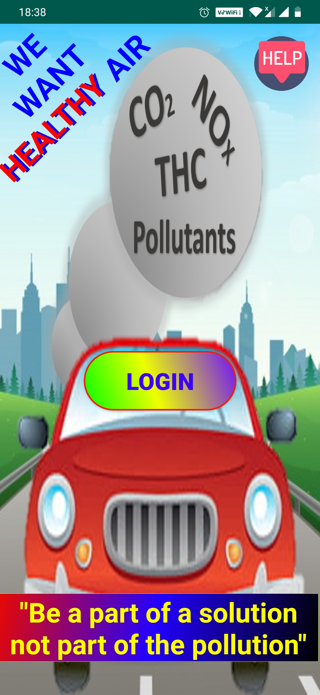
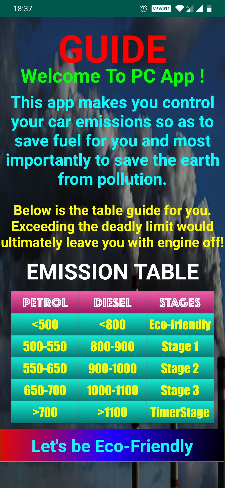
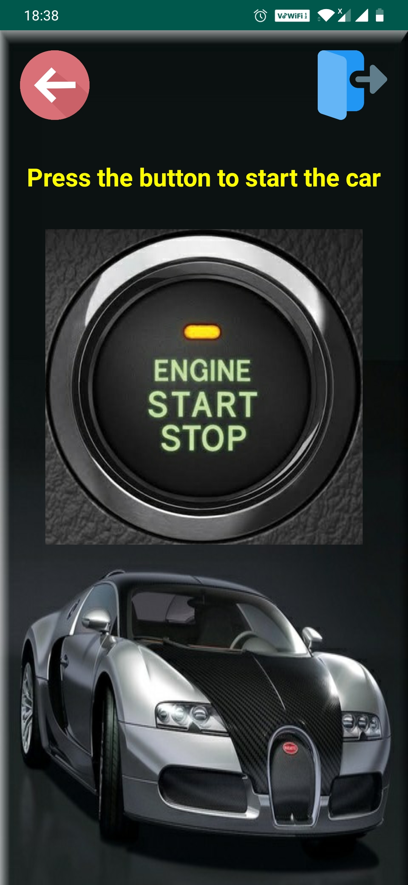
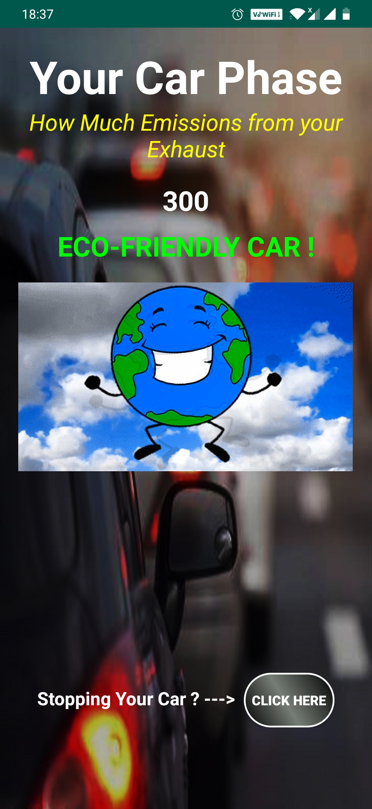

# Polution Controller App

This is an android application in association with IoT. This is a step towards reducing air pollution levels being caused by the emissions exhausted from the vehicles.

#### Description
Basically the app does the job of warning the drivers if the amount of emissions from their vehicles gets exceeded beyond the standard rates. This amount is being stored in our firebase by the IoT Sensor.

#### Languages
The app is made in Java 
The arduino code is written in C

#### Preview
 &nbsp;&nbsp;&nbsp;   &nbsp;&nbsp;&nbsp; 
